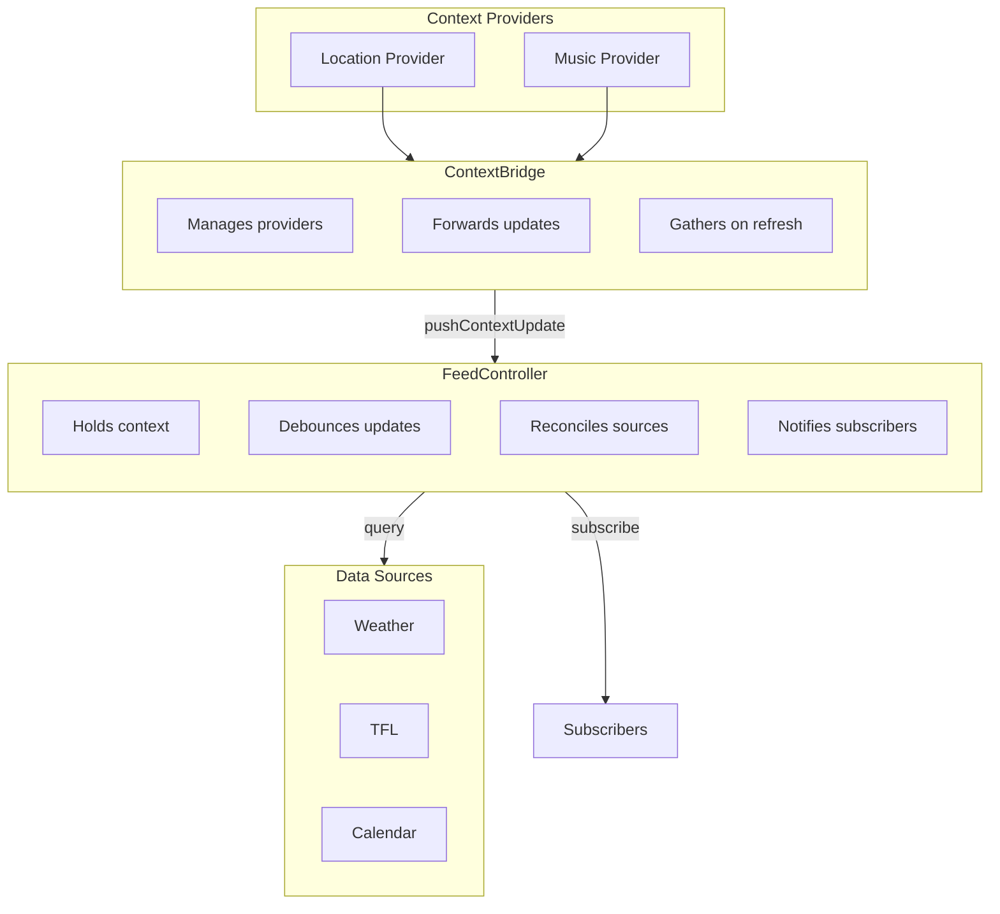

# @aris/core

Core orchestration layer for ARIS feed reconciliation.

## Overview



## Usage

### Define Context Keys

Each package defines its own typed context keys:

```ts
import { contextKey, type ContextKey } from "@aris/core"

interface Location {
	lat: number
	lng: number
	accuracy: number
}

export const LocationKey: ContextKey<Location> = contextKey("location")
```

### Create Data Sources

Data sources query external APIs and return feed items:

```ts
import { contextValue, type Context, type DataSource, type FeedItem } from "@aris/core"

type WeatherItem = FeedItem<"weather", { temp: number; condition: string }>

class WeatherDataSource implements DataSource<WeatherItem> {
	readonly type = "weather"

	async query(context: Context): Promise<WeatherItem[]> {
		const location = contextValue(context, LocationKey)
		if (!location) return []

		const data = await fetchWeather(location.lat, location.lng)
		return [
			{
				id: `weather-${Date.now()}`,
				type: this.type,
				priority: 0.5,
				timestamp: context.time,
				data: { temp: data.temp, condition: data.condition },
			},
		]
	}
}
```

### Create Context Providers

Context providers push updates reactively and provide current values on demand:

```ts
import type { ContextProvider } from "@aris/core"

class LocationProvider implements ContextProvider<Location> {
	readonly key = LocationKey

	onUpdate(callback: (value: Location) => void): () => void {
		const watchId = navigator.geolocation.watchPosition((pos) => {
			callback({
				lat: pos.coords.latitude,
				lng: pos.coords.longitude,
				accuracy: pos.coords.accuracy,
			})
		})
		return () => navigator.geolocation.clearWatch(watchId)
	}

	async getCurrentValue(): Promise<Location> {
		const pos = await new Promise<GeolocationPosition>((resolve, reject) => {
			navigator.geolocation.getCurrentPosition(resolve, reject)
		})
		return {
			lat: pos.coords.latitude,
			lng: pos.coords.longitude,
			accuracy: pos.coords.accuracy,
		}
	}
}
```

### Wire It Together

```ts
import { ContextBridge, FeedController } from "@aris/core"

// Create controller with data sources
const controller = new FeedController({ debounceMs: 100 })
	.addDataSource(weatherSource)
	.addDataSource(tflSource)

// Bridge context providers to controller
const bridge = new ContextBridge(controller)
	.addProvider(locationProvider)
	.addProvider(musicProvider)

// Subscribe to feed updates
controller.subscribe((result) => {
	console.log("Feed items:", result.items)
	console.log("Errors:", result.errors)
})

// Manual refresh (gathers from all providers)
await bridge.refresh()

// Direct context update (bypasses providers)
controller.pushContextUpdate({
	[CurrentTrackKey]: { trackId: "123", title: "Song", artist: "Artist", startedAt: new Date() },
})

// Cleanup
bridge.stop()
controller.stop()
```

### Per-User Pattern

Each user gets their own controller instance:

```ts
const connections = new Map<string, { controller: FeedController; bridge: ContextBridge }>()

function onUserConnect(userId: string, ws: WebSocket) {
	const controller = new FeedController({ debounceMs: 100 })
		.addDataSource(weatherSource)
		.addDataSource(tflSource)

	const bridge = new ContextBridge(controller).addProvider(createLocationProvider())

	controller.subscribe((result) => {
		ws.send(JSON.stringify({ type: "feed-update", items: result.items }))
	})

	connections.set(userId, { controller, bridge })
}

function onUserDisconnect(userId: string) {
	const conn = connections.get(userId)
	if (conn) {
		conn.bridge.stop()
		conn.controller.stop()
		connections.delete(userId)
	}
}
```

## API

### Context

| Export                       | Description                             |
| ---------------------------- | --------------------------------------- |
| `ContextKey<T>`              | Branded type for type-safe context keys |
| `contextKey<T>(key)`         | Creates a typed context key             |
| `contextValue(context, key)` | Type-safe context value accessor        |
| `Context`                    | Time + arbitrary key-value bag          |

### Data Sources

| Export                       | Description                       |
| ---------------------------- | --------------------------------- |
| `DataSource<TItem, TConfig>` | Interface for feed item producers |
| `FeedItem<TType, TData>`     | Single item in the feed           |

### Orchestration

| Export               | Description                                          |
| -------------------- | ---------------------------------------------------- |
| `FeedController`     | Holds context, debounces updates, reconciles sources |
| `ContextProvider<T>` | Reactive + on-demand context value provider          |
| `ContextBridge`      | Bridges providers to controller                      |

### Reconciler

| Export               | Description                                   |
| -------------------- | --------------------------------------------- |
| `Reconciler`         | Low-level: queries sources, sorts by priority |
| `ReconcileResult<T>` | Items + errors from reconciliation            |
