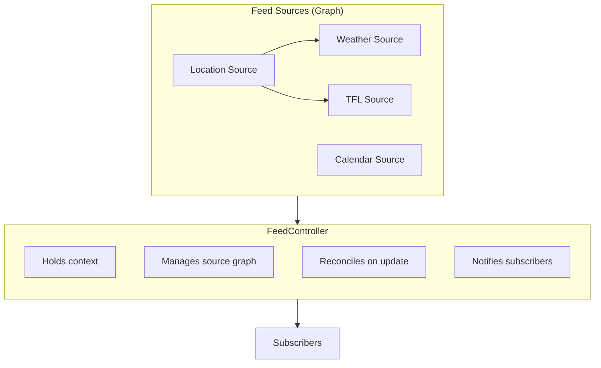

# @aris/core

Core orchestration layer for ARIS feed reconciliation.

## Overview



## Concepts

### FeedSource

A unified interface for sources that provide context and/or feed items. Sources form a dependency graph.

```ts
interface FeedSource<TItem extends FeedItem = FeedItem> {
	readonly id: string
	readonly dependencies?: readonly string[]

	// Context production (optional)
	onContextUpdate?(
		callback: (update: Partial<Context>) => void,
		getContext: () => Context,
	): () => void
	fetchContext?(context: Context): Promise<Partial<Context>>

	// Feed item production (optional)
	onItemsUpdate?(callback: (items: TItem[]) => void, getContext: () => Context): () => void
	fetchItems?(context: Context): Promise<TItem[]>
}
```

A source may:

- Provide context for other sources (implement `fetchContext`/`onContextUpdate`)
- Produce feed items (implement `fetchItems`/`onItemsUpdate`)
- Both

### Context Keys

Each package exports typed context keys for type-safe access:

```ts
import { contextKey, type ContextKey } from "@aris/core"

interface Location {
	lat: number
	lng: number
}

export const LocationKey: ContextKey<Location> = contextKey("location")
```

## Usage

### Define a Context-Only Source

```ts
import type { FeedSource } from "@aris/core"

const locationSource: FeedSource = {
	id: "location",

	onContextUpdate(callback, _getContext) {
		const watchId = navigator.geolocation.watchPosition((pos) => {
			callback({
				[LocationKey]: { lat: pos.coords.latitude, lng: pos.coords.longitude },
			})
		})
		return () => navigator.geolocation.clearWatch(watchId)
	},

	async fetchContext() {
		const pos = await getCurrentPosition()
		return {
			[LocationKey]: { lat: pos.coords.latitude, lng: pos.coords.longitude },
		}
	},
}
```

### Define a Source with Dependencies

```ts
import type { FeedSource, FeedItem } from "@aris/core"
import { contextValue } from "@aris/core"

type WeatherItem = FeedItem<"weather", { temp: number; condition: string }>

const weatherSource: FeedSource<WeatherItem> = {
	id: "weather",
	dependencies: ["location"],

	async fetchContext(context) {
		const location = contextValue(context, LocationKey)
		if (!location) return {}

		const weather = await fetchWeatherApi(location)
		return { [WeatherKey]: weather }
	},

	async fetchItems(context) {
		const weather = contextValue(context, WeatherKey)
		if (!weather) return []

		return [
			{
				id: `weather-${Date.now()}`,
				type: "weather",
				priority: 0.5,
				timestamp: new Date(),
				data: { temp: weather.temp, condition: weather.condition },
			},
		]
	},
}
```

### Graph Behavior

The source graph:

1. Validates all dependencies exist
2. Detects circular dependencies
3. Topologically sorts sources

On refresh:

1. `fetchContext` runs in dependency order
2. `fetchItems` runs on all sources
3. Combined items returned to subscribers

On reactive update:

1. Source pushes context update via `onContextUpdate` callback
2. Dependent sources re-run `fetchContext`
3. Affected sources re-run `fetchItems`
4. Subscribers notified

## API

### Context

| Export                       | Description                             |
| ---------------------------- | --------------------------------------- |
| `ContextKey<T>`              | Branded type for type-safe context keys |
| `contextKey<T>(key)`         | Creates a typed context key             |
| `contextValue(context, key)` | Type-safe context value accessor        |
| `Context`                    | Time + arbitrary key-value bag          |

### Feed

| Export                   | Description              |
| ------------------------ | ------------------------ |
| `FeedSource<TItem>`      | Unified source interface |
| `FeedItem<TType, TData>` | Single item in the feed  |

### Legacy (deprecated)

| Export                       | Description              |
| ---------------------------- | ------------------------ |
| `DataSource<TItem, TConfig>` | Use `FeedSource` instead |
| `ContextProvider<T>`         | Use `FeedSource` instead |
| `ContextBridge`              | Use source graph instead |
